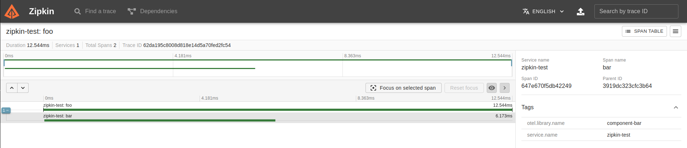
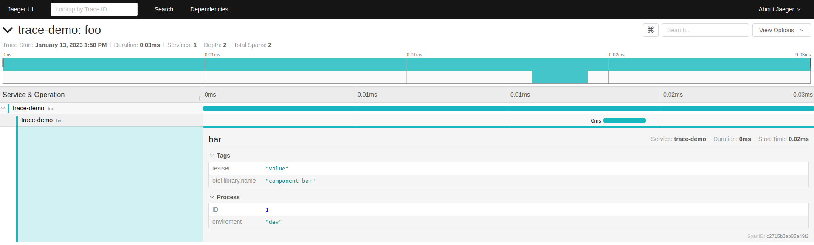
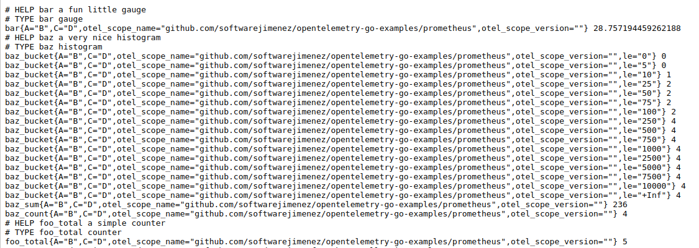
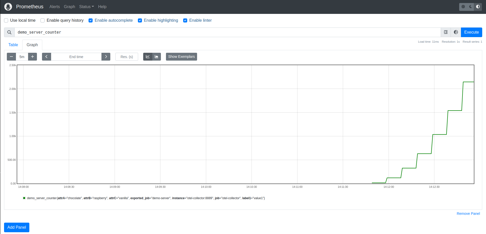
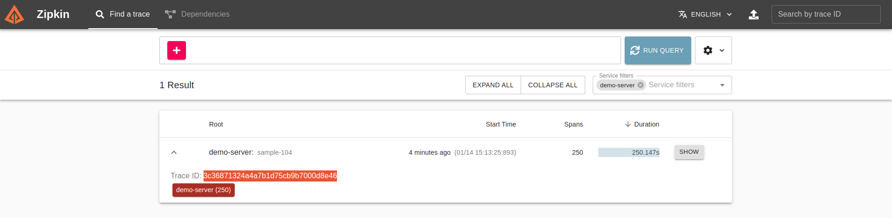
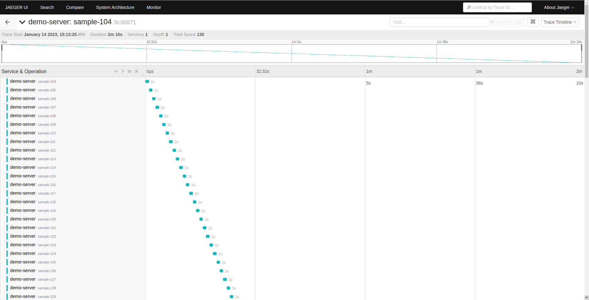

# opentelemetry-go-examples
Example of open telemetry in Go

## Example 1 - Fibonacci
- Ref:
    - https://opentelemetry.io/docs/instrumentation/go/getting-started/
    - https://github.com/open-telemetry/opentelemetry-go/tree/main/example/fib

- Running:
```
cd fibonacci
go run .
cat traces.txt
```

## Example 2 - Zipkin

Send an example span to a Zipkin service.
- Ref: https://github.com/open-telemetry/opentelemetry-go/tree/main/example/zipkin

- Running:
```
docker run -p 9411:9411 openzipkin/zipkin
go run main.go
```
- Open zipkin with the trace writen http://localhost:9411/zipkin/traces/62da195c8008d818e14d5a70fed2fc54



## Example 3 - Jaeger

Send an example span to a Jaeger service.
- Ref: https://github.com/open-telemetry/opentelemetry-go/tree/main/example/jaeger

- Running:
```
docker run --name jaeger \
  -e COLLECTOR_ZIPKIN_HTTP_PORT=9411 \
  -p 5775:5775/udp \
  -p 6831:6831/udp \
  -p 6832:6832/udp \
  -p 5778:5778 \
  -p 16686:16686 \
  -p 14268:14268 \
  -p 9411:9411 \
  jaegertracing/all-in-one:1.6
go run main.go
```
- Open Jaeger with the trace writen http://localhost:16686/trace/ec050c45678c972950e818fa88b36fad



## Example 4 - Prometheus

Send metris to a Prometheus service.
- Ref: https://github.com/open-telemetry/opentelemetry-go/tree/main/example/prometheus

- Running:
```
go run main.go
```
- Open the metrics in Prometheus http://localhost:2223/metrics



## Example 5 - Opentelemetry colector k8s

This example illustrates how to export trace and metric data from the OpenTelemetry-Go SDK to the OpenTelemetry Collector. From there, we bring the trace data to Jaeger and the metric data to Prometheus The complete flow is:
```
                                          -----> Jaeger (trace)
App + SDK ---> OpenTelemetry Collector ---|
                                          -----> Prometheus (metrics)
```
- Ref: https://github.com/open-telemetry/opentelemetry-go/tree/main/example/otel-collector

- Prerequisites:
  - MicroK8s
    ```
    sudo snap install microk8s --classic
    microk8s enable dns storage
    microk8s enable observability
    ```
- Running:
  - Terminal 1
    ```

      // Create namespace 
      microk8s kubectl apply -f k8s/namespace.yaml

      // Deploy jaeger 
      microk8s kubectl create -n observability -f https://github.com/jaegertracing/jaeger-operator/releases/download/v1.41.0/jaeger-operator.yaml

      microk8s kubectl apply -f k8s/jaeger.yaml

      // Deploy prometheus
      microk8s kubectl apply -f k8s/prometheus-service.yaml   # Prometheus instance
	    microk8s kubectl apply -f k8s/prometheus-monitor.yaml   # Service monitor

      // Deploy opentelemetry colector 
      microk8s kubectl apply -f k8s/otel-collector.yaml
    ```
  - Terminal 2:
    ```
      go run main.go
    ```

- Clean up
```
microk8s kubectl delete -f k8s/otel-collector.yaml

microk8s kubectl delete -f k8s/prometheus-monitor.yaml
microk8s kubectl delete -f k8s/prometheus-service.yaml

microk8s kubectl delete -f k8s/jaeger.yaml

microk8s kubectl delete -n observability -f https://github.com/jaegertracing/jaeger-operator/releases/download/v1.41.0/jaeger-operator.yaml
microk8s kubectl delete namespaces observability
```

## Example 6 - Opentelemetry colector docker-compose

This example illustrates how to export trace and metric data from the OpenTelemetry-Go SDK to the OpenTelemetry Collector. From there, we bring the trace data to Jaeger and the metric data to Prometheus The complete flow is:
```
                                          -----> Jaeger (trace)
                                          -----> zipkin (trace)
App + SDK ---> OpenTelemetry Collector ---|
                                          -----> Prometheus (metrics)
```
- Ref: https://github.com/open-telemetry/opentelemetry-collector-contrib/tree/main/examples/demo

- Running:
  - Terminal 1
    ```
      docker-compose up
    ```
  - Terminal 2:
    ```
      go run main.go
    ```
- Open the metrics in Prometheus http://0.0.0.0:9090/

- Open the trace in Zipkin http://0.0.0.0:941/

- Open the trace in Jaeger http://0.0.0.0:16686/



- Clean up
  - Terminal 1
    ```
      docker-compose down
    ```

